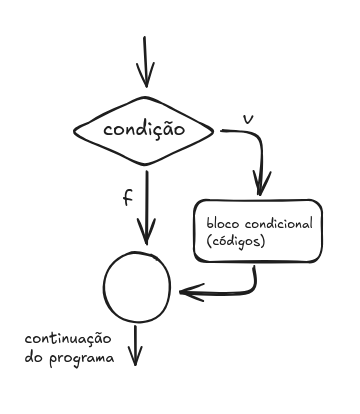

# Intro Paradigma de Programação Orientada a Objetos

Para entender o os conceitos de POO, usaremos java que é uma linguagem totalmene voltada a esse paradigma, vamos usar os livros do professo Ricardo da Costa Veras - Liguagem de Programação Orientada a Objetos de I ao IV.

## Temas de cada modulo

- Modulo I - Classes, Objetos, Atributos, Métodos e estrutura lógica 
- Modulo II - Encapsulamento, Herança Polimorfismo e bases de entendimento dos modificadores private public protected e default, além de métodos construtores
- Mudulo III - Polimorfismo de classes e os modificadores static, final, abstract e as interfaces
- Mudulo IV - Execeções e processo paralelo

## Introdução

O paradigma da programação orientada a objetos possui três pilares:

- Herança; (Permite o reaproveitamento de código)
- Encapsulamento; (Protege a utilização inapropriada de atributos de uma classe)
- Polimorfismo; (Permite um elemento se comportar de forma diferente dependendo de como é estruturado)

OO representa entidades do mundo real

Objeto é um elemento criado em mémoria (RAM) a partir de um modelo da classe, de forma a possuir todas as suas caracteristicas. Já a classe é o molde para criar obejtos.

## Java

- O método main é o responsável por acionar um programa java. Ele precisa existir em apenas uma das classes do sistema construido (naquela que acionará o programa).

Sua sintaxe 

```java
public class ClasseA {
    public static void main(String[] args) {
        // Código
    }
}
```

- Classe são modelos para se construi os objetos, a classe possui
    - Atributos: elementos que definem a classe
    - Métodos: elementos que definem as possíveis ações dos obejetos gerados

- Representação da classe via UML


|classes| ordem
|-------|------|
|atributos| primeiro
|métodos| por último

Um exemplo de Classe qualquer e a disponibilidade dos atributos e métodos

```java
public class ClasseQualquer {
    
    public int atributo1;
    public int atributo2;
    public int atributoN;

    public void metodo1() {
        // Código do método
    }

    public void metodo2() {
        // Còdigo do método
    }
}
```

A sintaxe de uma classe deve ser:
```java
public class NomeDaClasse {
    //....
}
```
- Os objetos são as classes em memória, gerados quando o sistema é executado

A sintaxe de um objeto

```java
NomeDaClasse nomeDoObjeto = new NomeDaClasse();
```
Gerar um objeto em memória, é instanciar uma classe.
A partir de uma classe, podemos instanciar diversos objetos

- Atributo é uma caracteristica que defina uma classe.
exemplo

```java
public class ClasseQualquer {
    public int quantidadeProduto;
    // ou ainda
    public int quantidadeEstoque = 0;
    private String nomeSistema = "Sistema de Compras";
}
```
- Métodos é a ação que pode ser acionada após instanciar a classe. Métodos podem possuir parâmetros separados por virgula, e retornam algum valor, quando o método possui retorno, especificamos o tipo do dado retornado, se o método não possui retorno, o tipo é void.

- Modificadores de acesso
    - public;
    - private;
    - protected;
    - (defaut);

- Modificadores de comportamento
    - static; (este não é utilizado para classes)
    - final;
    - abstract (este não é utilizado para atributos)

Vejamos o exemplo:
```java
public class SomaValores {
    
    // - atributos da classe
    public int resultInt;
    public double resultDouble;

    // - métodos da classe
    public int somarInteiros(int a, int b) {
        int result = a + b;
        resultInt = result;
        return result;
    }

    public double somarReais(double a, double b) {
        double result = a+b;
        resultDouble = result;
        return result;
    }

    public void mostrarResultado() {
        String txt = "--------\n";
        txt += “Resultado da soma de Inteiros: “ + resultInt + “\n”;
        txt += “Resultado da soma de Reais: “ + resultDouble + “\n”;
        System.out.println(txt);
    }

    public static void main(String[] args) {
        SomaValores sv = new SomaValores();
        int vi = sv.somarInteiros(7,15);
        System.out.println(vi);
        double vd = sv.somarReais(3.6,9.2);
        System.out.println(vd);
        sv.mostrarResultado();
    }

}
```

Exemplo de aplicação
```java
package classeA;

public class ClasseA {
	
	public String x = "teste";
	public double y;
	
	public void metodo01(int a, int b) {
		System.out.println(a + ":" + b);
	}
	
	public int metodo02(String s) {
		x = s;
		int a = 4;
		return a;
	}
	
	public String metodo03(String z) {
		String s = x + z;
		System.out.println(s);
	}
	
}

/**
 * QUAL FOI O ERRO ENCONTRADO?
 * 
 * NO METODO03 FALTOU O RETORNO DO VALOR
 * 
 * 
 * */
```

variáveis e estrutura de controle e organização do projeto

estrutura de controle são as estruturas vinculadas à lógica de programação

### Tipos de variáveis

as variáveis são espaços reservados na memória e possuem um tipo, um nome e um valor

sintaxe das variáveis locais

tipoDaVariavel nomeDaVariavel;
Ou
tipoDaVariavel nomeDaVariavel = valorDaVariavel;

>variáveis locais não possuem modificadores na sua declaração

Os tipos são

- Númericos inteiros

    - byte
    - short
    - int
    - long

- Numéricos reais (de ponto flutuante)

    - float
    - double

- Lógicos

    - boolean

- Alfanumérico

    - char -> seu valor literal é usado entre aspas simples 
        - char a = 'c';

Esses são os tipos primitivos, no java o tipo String é um objeto, que possui diverssos métodos complementares

String str = new String();-> na forma de classe

String str = "Esta é uma String..."; -> na forma de um tipo primitivo

O valor atribuido ao tipo String é entre aspas duplas

### Estrutura condiciona

Em java temos 2 estruturas condicionais

if - else if - else
switch - case

- estrutura IF



- estrutura SWITCH

```java
int a = 10;

switch(a) {
    case 2: 
        System.out.println("A é = 2");
        break;
    case 5: 
        System.out.println("A é = 5");
        break;
    case 10: 
        System.out.println("A é = 10");
        break;
    default:
        System.out.println("Nenhuma delas";
        break;
}
```

### Estrutura de repetição

- For

```java

for (int i = 0; i < 10; i++) {
    System.out.println(i);
}

```

A estrutura for é útil para trabalhar com matrizes(Arrays)

Em java Array é uma variáve que pode conter mais de um valor, desde que seja do mesmo tipo
sintaxe

tipoArray[] var = new tipoArray[tamanho]

Os valores em arrays são organizados por indices, e sempre começa a contagem em 0

Exemplo

```java
int[] a = new int[3];
a[0] = 1;
a[1] = 2;
a[2] = 3;
System.out.println(a[1]); // 2

// é possível gerar um array com essa sintaxe também

double[] b = {1.2, 2.3, 3.4, 4.5};

// Usando o for para iterar sobre os arrays

for(int i = 0; i < a.length; i++) {
    System.out.println(i);
}

for(int i = 0; i < b.length; i++) {
    System.out.println(i);
}

```

- While

Uma estrutura de repetição controlado por uma condição, será executada enquanto a condição seja verdadeira

```java
int a = 0;
while(a<10) {
    System.out.println(a);
    a++;
}
```

- Do While

Diferente do while, o do executa o comando primeiro e depois testa a condição, e repete até que a condição se torne falsa

```java
int a = 10;
do {
    System.out.println(a);
    a--;
} while(a > 0);
```

### Packages (pacotes)

Packages são pacotes(categorias que separam as classes)

por exemplo,
```java
package model;

// é um diretório model que fica na raiz do projeto

package com.mysql.jdbc;

// é um diretório com/mysql/jdbc (três diretórios) que fica na raiz do projeto java
```

Se formos utilizar uma classe em outra classe que estamos usando, é necessário importar o pacote ou a biblioteca usamos a palavra

```java
import nome.do.pacote.Classe.
```

